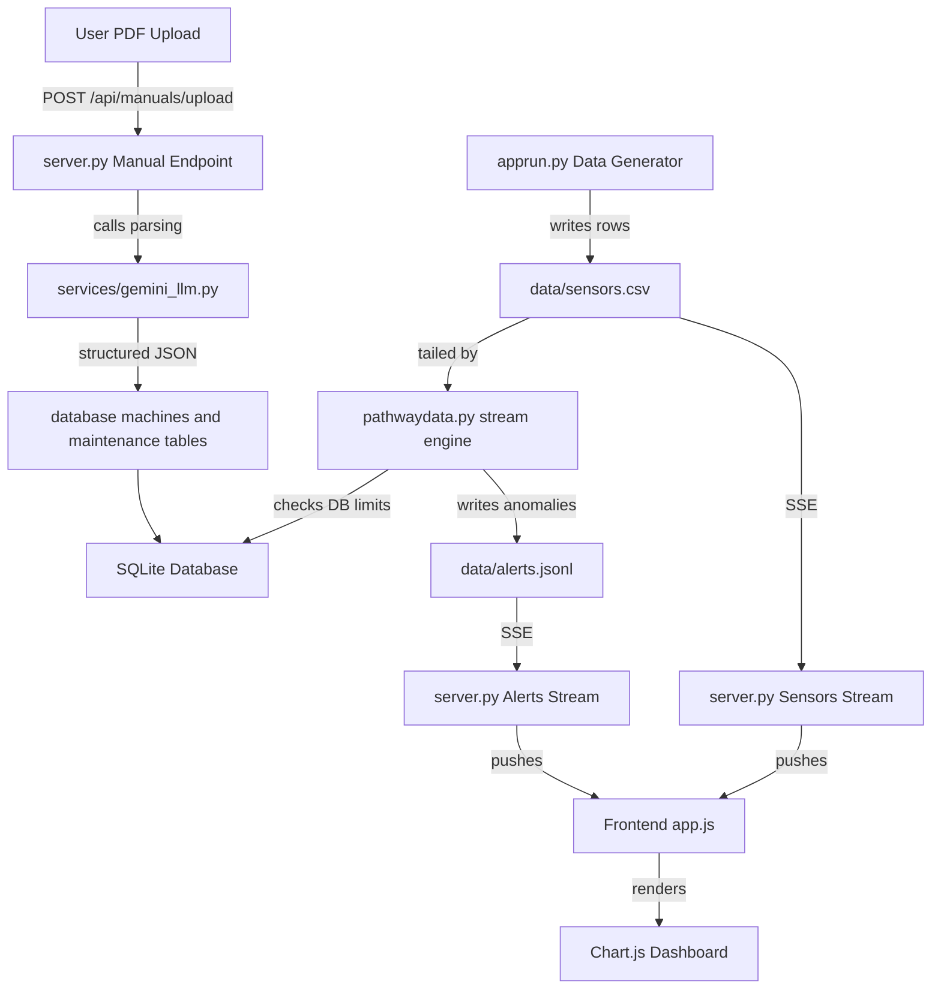

# EcoSync Sentinel — Real-time AI for Green Manufacturing

## Executive summary

EcoSync Sentinel is an industrial IoT monitoring and predictive maintenance platform for manufacturing floors. The system ingests machine telemetry (temperature, vibration, sound, energy and runtime), processes streams in real time, applies anomaly detection against machine-specific operating limits, and automates maintenance scheduling and spare-parts planning. A key capability is automatic extraction of operational thresholds and maintenance rules from OEM PDFs using an AI Digital Twin pipeline via Gemini 2.5 Pro, enabling the system to adapt thresholds per machine without manual configuration.

This repository contains a production-oriented prototype designed for demonstration and rapid deployment. It is engineered to be pragmatic and auditable.

---

## Table of contents

* Project overview
* Key features
* Technology stack
* System architecture
* Data flow
* File and component map
* Database schema
* Installation (local)
* Configuration
* Running the system
* API surface (important endpoints)
* Manual upload and LLM extraction workflow
* Maintenance worker and scheduling
* Dashboard and UI
* Demo checklist
* Known limitations and next steps
* Development notes
* License

---

## Project overview

EcoSync Sentinel makes manufacturing processes monitorable at machine granularity for both economic and ecological benefits. It reduces downtime by detecting anomalous machine behavior early, derives machine safe operating limits from manuals, automates maintenance tasks and spare part planning, and provides real-time dashboards and alerts.

Core value propositions:

* automated, auditable thresholds derived from machine manuals;
* real-time anomaly detection and alerting;
* automated maintenance scheduling and spare-part tracking;
* minimal setup and quick demoability.

---

## Key features

* Real-time telemetry ingestion and visualization (temperature, vibration, sound, energy)
* Pathway-driven / streaming analytics pipeline for low-latency anomaly detection
* Upload PDF manuals via Native Gemini API to extract:
  * operating temperature ranges
  * typical sound (dB) levels
  * maintenance schedule (detailed task list)
  * spare parts list (name, part number, description)
* Per-machine dynamic thresholds that override static defaults
* Instant SQLite database population of maintenance schedules purely via LLM logic
* Minimal setup and quick demoability with Python and SQLite

---

## Technology stack

* Backend: Python 3.10+ with FastAPI + Uvicorn
* Streaming / analytics: Pathway (for real-time ingestion; prototype approach uses tailing CSV)
* LLM integration: Google Gemini 2.5 Pro via the Vertex AI client (`google-genai`). Native PDF understanding for structured Pydantic schema generation
* Database: SQLite (file-based for reproducible demos)
* Frontend: Vanilla HTML/CSS/JavaScript SPA (`index.html`) with Chart.js for telemetry visualizations

---

## System architecture (conceptual)



---

## Data flow

1. **Generation:** `apprun.py` runs a background asyncio loop, writing simulated machine data (timestamp, machine ID, temp, vibration, energy) to `data/sensors.csv` every single second.
2. **Ingestion & Evaluation:** Pathway (`pathwaydata.py`) continuously reads the tail of the CSV file. For each row, it queries SQLite to check the specific, LLM-generated `temperature_max` config for that exact machine. If violated, it saves an alert to SQLite.
3. **Streaming:** FastAPI (`server.py`) constantly checks the CSV and the SQLite alerts table, rapidly pushing updates to the browser via two asynchronous SSE endpoints (`/api/stream/sensors` and `/api/stream/alerts`).
4. **Visualization:** `app.js` receives the SSE payloads and updates the Chart.js graphs, scrolling terminal, and KPI numbers without *ever* reloading the page.

---

## File and component map

(Important files / directories in the repository)

```
apprun.py                # entry point; spawns generator, Pathway, and server
server.py                # FastAPI server, SSE endpoints, REST APIs, and core DB logic
services/
  gemini_llm.py          # Gemini 2.5 Pro wrapper for PDF document understanding
database/
  db.py                  # SQLite helpers and persistence layer
data/
  sensors.csv            # simulated telemetry (input for demo)
  alerts.jsonl           # anomaly logs (streamed out)
  manuals/               # uploaded manual PDFs
index.html               # frontend SPA (uses SSE and Chart.js)
app.js                   # frontend logic and routing
style.css                # styling and dark mode UI
requirements.txt         # python dependencies
```

---

## Database schema (high level)

The SQLite schema stores the following core entities:

* `machines`
  * id (unique)
  * name, type, description
  * operating_limits (JSON string for dynamic thresholds)

* `maintenance_tasks`
  * machine_id
  * task
  * interval
  * scheduled_date
  * done (boolean)
  * created_at

* `spare_parts`
  * machine_id
  * name
  * part_number
  * description
  * current_stock
  * minimum_required

* `alerts`
  * machine_id
  * level (e.g., WARNING / CRITICAL)
  * message
  * meta (JSON)
  * created_at

All DB interactions are in `database/db.py`; schema is initialized automatically on startup.

---

## Installation (local)

1. Create a Python virtual environment and activate it:

```bash
python3 -m venv venv
source venv/bin/activate
```

2. Install dependencies:

```bash
pip install --upgrade pip
pip install -r requirements.txt
```

---

## Configuration

Set environment variables before running the server if needed, for example:

```bash
export GCLOUD_PROJECT="your-google-cloud-project-id"
export ECOSYNC_DB="data/ecosync.db"
# If using Vertex AI, ensure your gcloud CLI is authenticated:
# gcloud auth application-default login
```

*(Note: The system falls back to default thresholds hardcoded in the pathway files if a manual has not been uploaded yet).*

---

## Running the system

Quick start (development mode):

Start the unified bootstrapper:

```bash
python apprun.py
```

`apprun.py` launches the telemetry generator (which writes `data/sensors.csv`), the streaming processor, and the FastAPI server (Uvicorn). Open your browser at:

```
http://localhost:8000/index.html
```

---

## API surface (important endpoints)

* `POST /api/manuals/upload`
  * Upload a machine manual (PDF). 
  * Instantly saves the PDF, calls Gemini 2.5 Pro to extract `operating_limits`, `maintenance_tasks`, and `spare_parts`, and writes them directly to SQLite. Returns JSON extraction result.
  * Overrides any existing settings for that Machine ID to prevent duplicate schedules.

* `GET /api/machines` and `GET /api/machines/{machine_id}`
  * Retrieve stored machines and operating thresholds.

* `GET /api/maintenance/schedule`
  * List scheduled maintenance tasks.

* `GET /api/inventory`
  * List spare parts and current stock thresholds.

* `GET /api/stream/sensors` (SSE)
  * Stream of sensor telemetry for real-time charting.

* `GET /api/stream/alerts` (SSE)
  * Stream of alerts generated by Pathway.

---

## Manual upload and LLM extraction workflow

1. User uploads a PDF via `/api/manuals/upload` on the Asset Diagnostics page.
2. The PDF is saved under `data/manuals`.
3. `server.py` checks if a cached JSON map exists in `data/manuals/manuals_json/`. If not, it executes `services/gemini_llm.py`.
4. Gemini natively ingests the PDF document, leveraging its multimodal understanding to extract limits, components, and service schedules, outputting strict JSON validation via Pydantic.
5. The endpoints instantly write this to `maintenance_tasks` and `spare_parts` tables in SQLite, generating accurate `scheduled_date` values using datetime math based on LLM-extracted `period` (days).
6. Next time a manual is uploaded for that Machine ID, it clears duplicates and generates a brand new schedule.

---

## Maintenance worker and scheduling

* The application does not require a background worker daemon to schedule tasks. 
* Instead, scheduling is event-driven during the PDF Upload. The LLM extracts the recommended interval, and Python dynamically computes the exact upcoming `YYYY-MM-DD` date to insert into the database.
* The Maintenance tab dynamically queries these tables via `/api/maintenance/schedule` to render the calendar interface.

---

## Dashboard and UI

The frontend is a single-page web app in `index.html`. Key panels:

* **Dashboard**: Live telemetry charts that overlay the active thresholds (sourced from the parsed manual if present). Alert banner and scrolling terminal event log for CRITICAL/WARNING alerts.
* **Diagnostics**: Manual management panel to upload manuals, review parsed output, and manually edit JSON operating limits.
* **Maintenance & Inventory**: Calendar list of upcoming tasks, and a spare-parts inventory view with an interactive BOM JSON export limit.

All UI interactions use Vanilla JS (`app.js`) to parse the SSE streams without reloading the page.

---

## Demo checklist

1. Boot app with `python apprun.py` and open `index.html`.
2. Wait for incoming sensor alerts to show standard data.
3. Switch to Asset Diagnostics and upload a PDF manual (e.g. Becker Pumps). 
4. Verify the extraction terminal pops up with the JSON. 
5. Switch to Maintenance to confirm the Calendar populated the tasks, and Inventory populated parts.
6. Check Dashboard to confirm new RED LINE thresholds have been dynamically rendered on the Chart.js instances.

---

## Known limitations and next steps

* Current demo pipeline uses a CSV tail for telemetry. For production, replace CSV with a time-series database (TimescaleDB / Kafka).
* LLM latency on large PDFs can take 15-20 seconds. 
* No persistent queue/worker for background email alerts when a CRITICAL anomaly hits.

---

## Development notes

* The parsing pipeline is intentionally simple: Native Gemini API structure forces perfect JSON limits every time.
* `apprun.py` utilizes heavy subprocessing via `python -c` to ensure all parallel engines (Uvicorn, Pathway, Async Generator) launch successfully natively without Docker overhead.

---

## License

This is a prototype hackathon project developed specifically as an entry for Green Manufacturing using Vertex AI and Pathway stream processing engine.
