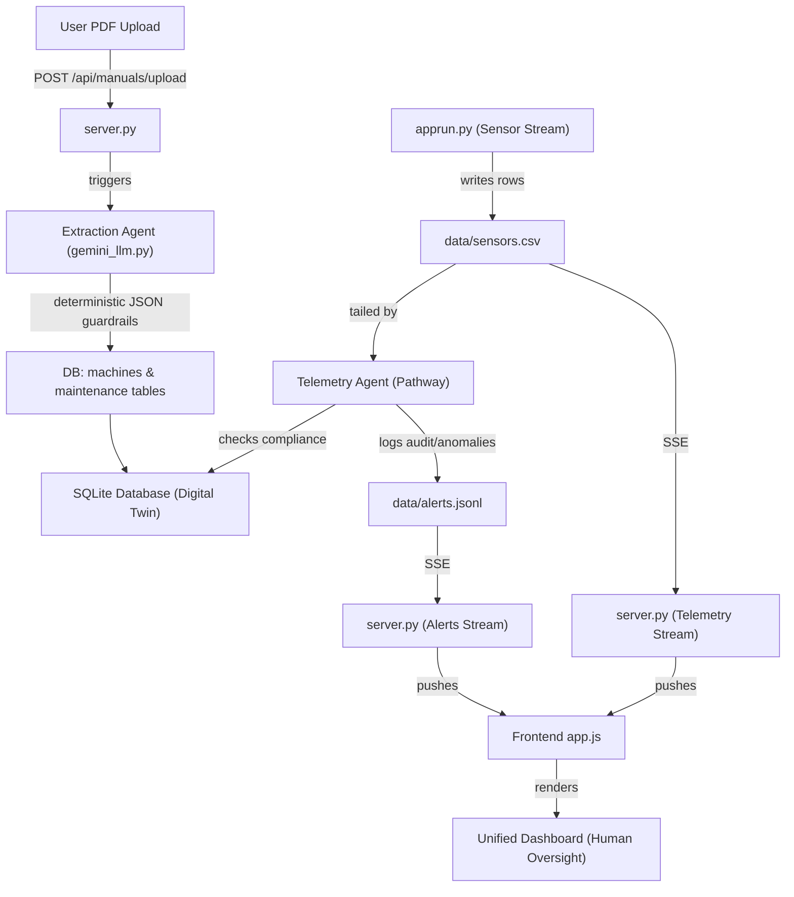

# 🏭 EcoSync Sentinel

> **Autonomous Multi-Agent Workflow for Supply Chain Resilience**
> *Confidential - Built for ET AI Hackathon 2026*

## 🚀 Executive Summary

**EcoSync Sentinel** is a domain-specialized, multi-agent platform designed to prevent industrial supply chain disruptions. The system ingests live machine telemetry (temperature, vibration, sound, energy) and processes it in sub-100 milliseconds. 

Instead of relying on static, manual configurations, EcoSync utilizes an **Extraction Agent (Gemini 2.5 Pro)** to autonomously read OEM PDF manuals and define strict, deterministic compliance guardrails. A high-speed **Telemetry Agent (Pathway)** monitors the data stream against these guardrails, while an **Orchestration Agent** handles edge cases, executes autonomous actions (e.g., triggering "Limp Mode"), and maintains an immutable audit trail for enterprise readiness.

---

## 📑 Table of Contents

- [🎯 Hackathon Rubric Alignment](#-hackathon-rubric-alignment)
- [🏗️ System Architecture](#️-system-architecture)
- [🧠 Multi-Agent Workflow](#-multi-agent-workflow)
- [📂 Repository Structure](#-repository-structure)
- [⚙️ Installation & Setup](#️-installation--setup)
- [🔌 API Surface](#-api-surface)
- [📊 Dashboard & UI](#-dashboard--ui)
- [🏁 Demo Checklist](#-demo-checklist)

---

## 🎯 Hackathon Rubric Alignment

This prototype is engineered to demonstrate multi-agent orchestration, complex edge-case handling, and strict regulatory compliance on the factory floor.

* **🤖 Multi-Agent Architecture:**
  * **Extraction Agent (Gemini):** Reads unstructured PDFs to build a deterministic JSON safety schema.
  * **Telemetry Agent (Pathway):** Sub-100ms Rust-powered stream processing engine.
  * **Orchestration Agent (FastAPI):** Handles state, scheduling, and escalation logic.
* **🛡️ Robust Edge Case Handling:**
  * *Ambiguous Documentation:* If a manual lacks clear thermal limits, the Extraction Agent refuses to hallucinate and escalates to a human engineer.
  * *Sensor Dropout:* Graceful degradation—if telemetry is lost, the system logs a disruption rather than triggering a false factory shutdown.
  * *SLA vs. Safety Conflict:* Autonomously triggers "Limp Mode" (throttling speed) to prevent a breakdown while keeping the supply chain moving.
* **💡 Cost Efficiency:** We use a heavy LLM (Gemini) *once* for initialization, and a highly efficient, open-source streaming core (Pathway) for continuous execution.

---

## 🏗️ System Architecture



---

## 🧠 Multi-Agent Workflow

1. **Compliance Ingestion:** A PDF is uploaded. The **Extraction Agent** parses the text/tables, identifies safety limits and maintenance intervals, and locks them into the SQLite database as deterministic guardrails.
2. **Live Telemetry:** `apprun.py` simulates high-frequency machine data (timestamp, temp, vibration), writing to `data/sensors.csv`.
3. **Sub-100ms Evaluation:** The **Telemetry Agent** continuously reads the stream. It queries the specific LLM-generated compliance config for that machine. If a guardrail is breached, it executes an action and logs to the audit trail.
4. **Orchestration & UI:** The **Orchestration Agent** manages SSE streams, updating the frontend dashboard instantly without page reloads.

---

## 📂 Repository Structure

```text
ecosync-sentinel/
├── apprun.py                # Entry point; spawns generators, Pathway, and FastAPI
├── server.py                # Orchestration Agent (FastAPI, SSE, REST APIs, DB logic)
├── services/
│   └── gemini_llm.py        # Extraction Agent (Gemini 2.5 Pro wrapper for PDFs)
├── database/
│   └── db.py                # SQLite helpers and Immutable Audit Trail layer
├── data/
│   ├── sensors.csv          # Simulated edge telemetry (input stream)
│   ├── alerts.jsonl         # Immutable anomaly logs (streamed out)
│   └── manuals/             # Uploaded OEM PDF manuals
├── index.html               # Frontend SPA dashboard
├── app.js                   # Frontend logic, SSE parsing, and routing
├── style.css                # Industrial Cyberpunk UI styling
└── requirements.txt         # Python dependencies
```

---

## ⚙️ Installation & Setup

1. **Clone and create a virtual environment:**
   ```bash
   python3 -m venv venv
   source venv/bin/activate
   ```

2. **Install dependencies:**
   ```bash
   pip install --upgrade pip
   pip install -r requirements.txt
   ```

3. **Configure Environment Variables:**
   ```bash
   export GEMINI_API_KEY="your-api-key"
   export ECOSYNC_DB="data/ecosync.db"
   ```

4. **Run the Multi-Agent Bootstrapper:**
   ```bash
   python apprun.py
   ```
   *Open your browser at: `http://localhost:8000/index.html`*

---

## 🔌 API Surface

* **`POST /api/manuals/upload`**
  * Triggers the **Extraction Agent**. Ingests the PDF, extracts operating limits, maintenance tasks, and spare parts, and writes them to the DB.
* **`GET /api/machines` & `GET /api/machines/{machine_id}`**
  * Retrieve Digital Twin states and active compliance thresholds.
* **`GET /api/maintenance/schedule` & `GET /api/inventory`**
  * Retrieve autonomous scheduling and supply chain (BOM) data.
* **`GET /api/stream/sensors` & `GET /api/stream/alerts`**
  * Real-time Server-Sent Events (SSE) for dashboard telemetry and audit logs.

---

## 📊 Dashboard & UI

The frontend (`index.html`) acts as the "Human-in-the-Loop" oversight interface:

* **Live Telemetry Terminal**: Chart.js graphs overlaying live data against the dynamic green/red guardrails defined by the LLM. 
* **Actionable Tasks**: An autonomous checklist generated by the agents, including escalations and required maintenance.
* **Diagnostics & Inventory**: PDF upload interface, JSON limit editor, and an interactive Bill of Materials (BOM) tracker to prevent supply chain shortages.

---

## 🏁 Demo Checklist

- [ ] Boot app with `python apprun.py` and open `index.html`.
- [ ] Show the **Dashboard** monitoring default sensor data.
- [ ] Switch to **Asset Diagnostics** and upload an OEM PDF manual. 
- [ ] Verify the **Extraction Agent** terminal logs the parsed JSON compliance guardrails.
- [ ] Switch to **Maintenance** to show autonomous task scheduling and spare-part inventory population.
- [ ] Return to the **Dashboard** to demonstrate the live telemetry charts actively reacting to the newly defined strict LLM thresholds, proving end-to-end agentic autonomy.

## 👥 Team

Honey Priya - Team Leader  
```

This is a prototype hackathon project developed specifically as an entry for Green Manufacturing using Vertex AI and Pathway stream processing engine.
