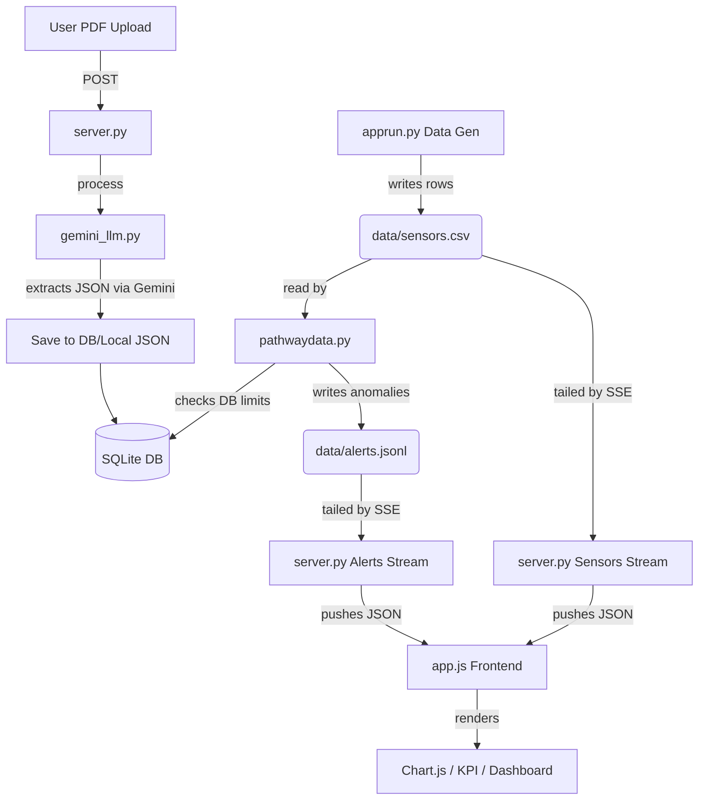

# Codebase Analysis: EcoSync Sentinel (Hack4GreenBharatPrototype)

## Executive Summary
EcoSync Sentinel is an industrial IoT dashboard and anomaly detection system. It generates mock sensor data, processes it via a stream-processing pipeline (Pathway), serves a responsive frontend via a FastAPI backend, and integrates LLM capabilities (Gemini 2.5 Pro) to parse machine manuals and extract operating limits and maintenance schedules. 

## System Architecture

The project follows a decoupled architecture using Python for the backend and a Vanilla JS Single Page Application (SPA) for the frontend.

1. **Entry Point & Process Manager ([apprun.py](file:///home/roy/Hack4GreenBharatPrototype/apprun.py))**
   - Bootstraps the application.
   - Runs an asynchronous data generator that creates mock machine data (temperature, vibration, energy) and writes to [data/sensors.csv](file:///home/roy/Hack4GreenBharatPrototype/data/sensors.csv).
   - Starts the Pathway data processing engine in a background thread.
   - Starts the `uvicorn` web server running the FastAPI app.

2. **Backend Server ([server.py](file:///home/roy/Hack4GreenBharatPrototype/server.py))**
   - Built with **FastAPI**.
   - Serves static frontend files ([index.html](file:///home/roy/Hack4GreenBharatPrototype/index.html), [app.js](file:///home/roy/Hack4GreenBharatPrototype/app.js), [style.css](file:///home/roy/Hack4GreenBharatPrototype/style.css)).
   - Provides REST APIs to list machines, get inventory, schedule maintenance, and update limits.
   - Contains a file upload endpoint (`/api/manuals/upload`) that passes PDFs to the Gemini service.
   - Implements Server-Sent Events (SSE) streams (`/api/stream/sensors` and `/api/stream/alerts`) to push live data and alerts to the frontend.

3. **Stream Processing Pipeline ([pathwaydata.py](file:///home/roy/Hack4GreenBharatPrototype/pathwaydata.py))**
   - Uses **Pathway** to tail and parse [data/sensors.csv](file:///home/roy/Hack4GreenBharatPrototype/data/sensors.csv) in real-time.
   - Applies anomaly detection logic by comparing real-time metrics against limits stored in the SQLite database (with a 5-second recurring cache).
   - Generates alerts (WARNING or CRITICAL) and writes them to [data/alerts.jsonl](file:///home/roy/Hack4GreenBharatPrototype/data/alerts.jsonl).

4. **Database Layer ([database/db.py](file:///home/roy/Hack4GreenBharatPrototype/database/db.py))**
   - Uses **SQLite** ([data/ecosync.db](file:///home/roy/Hack4GreenBharatPrototype/data/ecosync.db)).
   - Contains tables for: [machines](file:///home/roy/Hack4GreenBharatPrototype/server.py#45-50), `maintenance_tasks`, `spare_parts`, and [alerts](file:///home/roy/Hack4GreenBharatPrototype/server.py#289-323).
   - Initializes schemas automatically on startup.

5. **AI Integration ([services/gemini_llm.py](file:///home/roy/Hack4GreenBharatPrototype/services/gemini_llm.py))**
   - Connects to Google Cloud Vertex AI to use the `gemini-2.5-pro` model.
   - Takes technical PDF manuals and extracts structured JSON outputs matching a predefined [MachineSpecs](file:///home/roy/Hack4GreenBharatPrototype/services/gemini_llm.py#40-47) schema using structured generation.

6. **Frontend ([index.html](file:///home/roy/Hack4GreenBharatPrototype/index.html), [app.js](file:///home/roy/Hack4GreenBharatPrototype/app.js), [style.css](file:///home/roy/Hack4GreenBharatPrototype/style.css))**
   - A vanilla HTML/JS/CSS SPA tracking three views: **Dashboard**, **Asset Diagnostics**, and **Maintenance & Inventory**.
   - Connects to SSE streams for real-time telemetry and task updates.
   - Uses **Chart.js** with custom plugins to draw dynamic telemetry charts (Temperature, Vibration, Sound) overlaid with dynamic red threshold lines defined by the LLM.
   - Renders animated KPI tiles and emergency critical alert banners.

## Data Flow Diagram

## Configuration ([config.py](file:///home/roy/Hack4GreenBharatPrototype/config.py))
Provides dictionaries (`DEVELOPMENT_CONFIG`, `PRODUCTION_CONFIG`) to manage settings like API ports, thresholds, LLM models, window sizes, and regional CO2 emission factors, catering to different deployment environments.
